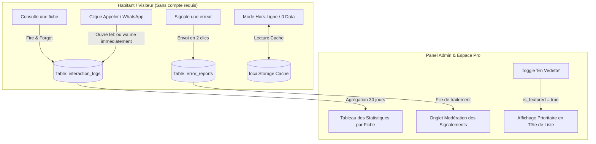

# Document de Conception : Tracking Commercial (Analytics), Signalements Citoyens & PWA Hors-Ligne — AIZÉ

> **Date :** 30/09/2026  
> **Statut :** Validé  
> **Cible :** Implémentation Lovable & Supabase pour le lancement MVP à Moramanga  

---

## 1. Architecture Globale

---

## 2. Spécifications du Bloc B : Tracking Commercial & Fiches "En Vedette"

### 2.1. Schéma Supabase
* **Table `interaction_logs` :**
  - `id` : `uuid` (PK, default `gen_random_uuid()`)
  - `establishment_id` : `uuid` (FK vers `directory_entries.id` ON DELETE CASCADE)
  - `action_type` : `text` CHECK (`action_type` IN (`'view'`, `'call'`, `'whatsapp'`, `'direction'`))
  - `created_at` : `timestamptz` (default `now()`)
* **Politiques RLS `interaction_logs` :**
  - `INSERT` : Public (`true`) — permet de compter les actions des visiteurs anonymes.
  - `SELECT` : Réservé aux administrateurs, modérateurs et au propriétaire (`owner_id = auth.uid()`) de l'établissement concerné.
* **Colonnes additionnelles sur `directory_entries` :**
  - `is_featured` : `boolean` (default `false`)
  - `featured_until` : `timestamptz` (nullable)

### 2.2. Comportement Frontend (Tolérance Réseau Lent)
* La fonction `logInteraction(establishmentId, actionType)` est exécutée de manière asynchrone **sans `await` bloquant** sur le thread UI principal.
* L'action native (`window.location.href = "tel:..."` ou ouverture WhatsApp) se déclenche instantanément (0 ms de latence).

---

## 3. Spécifications du Bloc C : Signalements Citoyens & PWA Hors-Ligne

### 3.1. Schéma Supabase (`error_reports`)
* **Table `error_reports` :**
  - `id` : `uuid` (PK, default `gen_random_uuid()`)
  - `establishment_id` : `uuid` (FK vers `directory_entries.id` ON DELETE CASCADE)
  - `issue_type` : `text` (`'wrong_phone'`, `'closed'`, `'wrong_landmark'`, `'wrong_hours'`, `'other'`)
  - `comment` : `text` (nullable)
  - `status` : `text` (`'pending'`, `'resolved'`, `'ignored'`, default `'pending'`)
  - `created_at` : `timestamptz` (default `now()`)
* **Politiques RLS `error_reports` :**
  - `INSERT` : Public (`true`)
  - `SELECT` / `UPDATE` : Admins et Modérateurs uniquement.

### 3.2. Configuration PWA & Cache de Secours
1. **Web App Manifest (`public/manifest.json`) :**
   - Couleurs : `theme_color: "#0a1931"`, `background_color: "#ffffff"`.
   - Affichage : `display: "standalone"`, `orientation: "portrait"`.
2. **Bannière d'installation (`InstallPWABanner.tsx`) :**
   - Écoute l'événement `beforeinstallprompt` sur Android/Chrome.
   - Propose un bouton d'installation rapide et mémorise le refus pendant 7 jours si fermé.
3. **Cache Hors-Ligne (`localStorage`) :**
   - Sauvegarde automatique de la liste des établissements validés sous la clé `aize_cached_directory_v1`.
   - En cas d'échec réseau (`!navigator.onLine` ou erreur de requête Supabase), bascule automatiquement sur le cache local avec un bandeau d'information rassurant.
