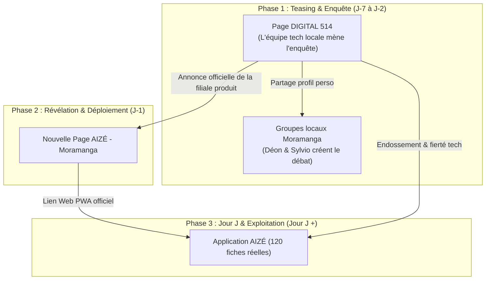

# Plan de Conception & Stratégie de Lancement Facebook — AIZÉ by DIGITAL 514

> **Date :** 30/09/2026  
> **Auteur :** Lead Marketing Digital (AIZÉ & DIGITAL 514)  
> **Cible :** Habitants, commerçants, artisans et visiteurs de Moramanga (Madagascar)  
> **Canaux :** Page Facebook DIGITAL 514 (Incubateur) ➔ Page Facebook AIZÉ Moramanga (Produit) + Groupes locaux (*Moramanga Bazar*, *Vaovao Moramanga*, *Entraide 514*)

---

## 1. Architecture de Marque & Stratégie "Tremplin"



---

## 2. Structure Notion Ready-to-Automate (Schéma de Base de Données)

Pour une intégration directe dans **Notion** et une automatisation (via Make / Zapier / Publer / Buffer), chaque publication respecte les propriétés de base de données suivantes :

| Nom de Propriété Notion | Type Notion | Rôle pour l'automatisation |
| :--- | :--- | :--- |
| `Nom du Post` | Titre | Identifiant unique (ex: *J-7 : Mécaniciens Moto*) |
| `Date & Heure` | Date | Heure de publication programmée (GMT+3 Madagascar) |
| `Canal Émetteur` | Sélecteur | `Page DIGITAL 514` ou `Page AIZÉ` |
| `Phase` | Sélecteur | `Teasing`, `Transition`, `Lancement Officiel` |
| `Texte Malagasy` | Texte riche | Corps principal pour accroche locale |
| `Texte Français` | Texte riche | Traduction / reformulation professionnelle |
| `Premier Commentaire` | Texte riche | Question de relance automatique pour déclencher les réponses |
| `Prompt Visuel` | Texte brut | Instructions précises pour Bidy ou outil IA (Nano Banana / Midjourney) |
| `Groupes de Partage` | Multi-sélecteur | Groupes cibles où Déon doit relayer |
| `Statut` | Statut | `Idée` ➔ `Rédigé` ➔ `Visuel Prêt` ➔ `Programmé` ➔ `Publié` |

---

## 3. Calendrier Éditorial Complet (Posts Intégraux & Prêts à l'Emploi)

### 🗓️ JOUR 1 (J-7) — Lundi à 08h30
* **Identifiant :** `J-7 : La Galère Mécanique à Moramanga`
* **Émetteur :** Page **DIGITAL 514**
* **Objectif :** Toucher un problème quotidien universel, créer une forte identification.
* **Texte de la Publication (Bilingue) :**
```text
🏍️ Sendra ny mafy : Rehefa simba tampoka ny moto amin'ny 19h hariva iny, aiza no misy mécano tena azo antoka sady mbola mandray eto Moramanga ?

Mba zarao amin'ny commentaire ny adiresy na ny numéro fantatrareo, sao misy namana sahirana mila vonjy anio hariva ! 👇

---
[FR] En panne de moto à la tombée de la nuit : quel est votre mécanicien de confiance encore disponible à Moramanga ? Partagez vos repères et bons contacts en commentaire pour aider la communauté ! 📍
#Moramanga #Madagascar #Mecanique #Entraide514 #Digital514
```
* **Premier Commentaire (à poster immédiatement par DIGITAL 514) :**
  > *« Ohatra hoe eny Ambony sa eny amin'ny Gare no tena misy mahay manao dépannage maika ? »*
* **Prompt Visuel pour Bidy / IA :**
  > `Clean vector graphic banner, midnight navy (#0a1931) background, silhouette of a motorcycle wrench crossed with a location pin in vibrant coral (#ff6b6b), bold text overlay: 'AIZA NO MISY MÉCANO REHEFA HARIVA ?', modern flat style, no clutter, high contrast.`
* **Consigne Déon (Partage) :** Partager sur *Moramanga Bazar Be* et *Môtô Moramanga* avec le message perso : *« Efa nisy sendra an'ity ve ianareo ? Za aloha nisy fotoana nitsosika hatreny Moramanga Ville vao nahita. »*

---

### 🗓️ JOUR 2 (J-6) — Mardi à 19h00 (Créneau du Soir)
* **Identifiant :** `J-6 : L'Urgence Nocturne & Pharmacie de Garde`
* **Émetteur :** Page **DIGITAL 514**
* **Objectif :** Émotionnel, utilité vitale, prépare la fonctionnalité clé d'AIZÉ.
* **Texte de la Publication :**
```text
💊 Fanontaniana maika ho an'ny mponin'i Moramanga :

Rehefa misy olona marary tampoka amin'ny misasakalina ka mila fanafody haingana... Aiza no fomba hahalalanareo hoe iza amin'ireo pharmacie eto an-tampon-tanàna no MIHIDAY (de garde) anio alina ?

Mbola mandeha mitsapa eny an-toerana ve sa efa manana numéro fiantsoana ianareo ?

---
[FR] Urgence nocturne à Moramanga : comment savez-vous quelle pharmacie est de garde ce soir sans devoir faire le tour de la ville à pied ? Partagez vos astuces en commentaire !
#Moramanga #Sante #Pharmacie #MoramangaVille #Digital514
```
* **Premier Commentaire :**
  > *« Raha manana ny lisitry ny pharmacie sy ny laharana fiantsoana azy rehetra ao anaty finday ve ianareo dia manampy ? »*
* **Prompt Visuel :**
  > `Minimalist graphic illustration, dark night sky over Moramanga street silhouette, glowing pharmacy cross in coral red and soft cream (#ffeac1), text banner: 'PHARMACIE DE GARDE : AHOANA NO FAHITA AZY ?', high legibility.`
* **Consigne Déon :** Relayer dans les groupes familiaux et d'entraide de quartier.

---

### 🗓️ JOUR 3 (J-5) — Mercredi à 12h15 (Pause Déjeuner)
* **Identifiant :** `J-5 : Quiz Visuel "Aiza eto Moramanga ?"`
* **Émetteur :** Page **DIGITAL 514**
* **Objectif :** Gamification, viralité pure, fierté d'appartenance à la ville.
* **Texte de la Publication :**
```text
📸 QUIZ MORAMANGA : Mponina tena teratany ihany no mahafantatra an'ity toerana ity !

Jereo tsara ity sary ity... AIZA marina eto an-tampon-tanàna no misy an'ity repère ity ? 📍
Soraty ao amin'ny commentaire ny valiny ! 👇

---
[FR] Seuls les vrais habitants de Moramanga reconnaîtront ce lieu ! À quel carrefour ou bâtiment correspond cette photo ? Donnez votre réponse en commentaire !
#Moramanga #QuizMoramanga #AlaotraMangoro #Digital514
```
* **Prompt Visuel (Photo réelle Bidy obligatoire) :**
  > *Photo nette prise par Bidy d'un bâtiment ou détail emblématique (près de la Mairie, de la Gare Madarail ou d'un carrefour vers Camp des Mariés). Cadrage serré mais reconnaissable.*
* **Consigne Déon :** Répondre aux commentaires avec humour (*« Mbola tsy izany ! »*, *« Efa manakaiky ! »*).

---

### 🗓️ JOUR 4 (J-4) — Jeudi à 11h30 (Avant le Repas)
* **Identifiant :** `J-4 : La Gastronomie Locale & Bonnes Adresses`
* **Émetteur :** Page **DIGITAL 514**
* **Objectif :** Fédérer les commerçants, valoriser les gargotes et la convivialité.
* **Texte de la Publication :**
```text
🍲 Ny tsiron'i Moramanga !

Rehefa mamirifiry ny andro na mila mamerina aina amin'ny antoandro : AIZA ny toerana misy soupe, radaka na sakafo mafana tena matsiro sy madio indrindra eto Moramanga ?

Asio mention na lazao ny anaran'ilay gargote na resto ankafizinao indrindra mba ho fantatry ny rehetra ! 😋👇

---
[FR] Avis aux gourmets : quelle est la meilleure adresse de soupe ou de spécialité locale à Moramanga ? Taguez votre gargote ou restaurant favori en commentaire !
#Moramanga #Sakafo #Gargote #BonsPlans514 #Digital514
```
* **Premier Commentaire :**
  > *« Ny eny Lalan'ny Gara ve sa eny amin'ny Tsena no misy an'ilay soupe tsy mahafoy ? »*
* **Prompt Visuel :**
  > `Appetizing modern flat vector graphic of a steaming bowl of soup, warm cream peach background (#ffeac1), bold navy typography (#0a1931): 'AIZA NY SOUPE MATSIRO INDRINDRA ETO ?', friendly food icon aesthetic.`

---

### 🗓️ JOUR 5 (J-3) — Vendredi à 15h00 (Préparation du Week-end)
* **Identifiant :** `J-3 : Les Déplacements & Taxi-brousse`
* **Émetteur :** Page **DIGITAL 514**
* **Objectif :** Toucher les transporteurs, coopératives et usagers de la route.
* **Texte de la Publication :**
```text
🚐 Ho an'izay mpandeha matetika na mivoaka an'i Moramanga :

Rehefa handeha ho any Tana, Toamasina na Ambatondrazaka : Coopérative na taxi-brousse iza no tena manaja ora sady azo antoka indrindra aminareo ?

Inona no tena mampitaraina rehefa eo amin'ny Gare routière ? Mba zarao ny hevitrao ! 👇

---
[FR] Déplacements régionaux : quelle coopérative de transport respecte le mieux les horaires au départ de Moramanga ? Partagez vos expériences et conseils utiles !
#Moramanga #Transports #TaxiBrousse #Cooperative #Digital514
```
* **Premier Commentaire :**
  > *« Mba manana ny numéro fiantsoana mivantana ny gares ve ianareo sa tsy maintsy midina eny foana ? »*
* **Prompt Visuel :**
  > `Vector illustration of a local taxi-brousse / minibus on the RN2 road, modern flat design with midnight navy (#0a1931) and vibrant coral (#ff6b6b) touches, text: 'COOPÉRATIVE IZA NO TENA MANAJA ORA ?'.`

---

### 🗓️ JOUR 6 (J-2) — Samedi à 10h00
* **Identifiant :** `J-2 : Le Grand Bilan & Le Mystère Révélé`
* **Émetteur :** Page **DIGITAL 514**
* **Objectif :** Faire la synthèse des problèmes identifiés et annoncer la solution sans donner le lien tout de suite.
* **Texte de la Publication :**
```text
💡 Nandritra ity herinandro ity, nanontany anareo ny ekipan'ny DIGITAL 514...

Ary nisy zava-dehibe tsikaritray :
1. Manana olona mahay sy toerana tsara be dia be isika eto Moramanga (mécano, dokotera, mpivarotra, mpanao asa tanana...).
2. SAINGY : miparitaka loatra ny laharana finday, tsy fantatra ny ora fisokafana, ary sarotra ny mahita azy rehefa tena maika !

Ahoana raha misy fitaovana iray maivana, ao anaty finday, maimaim-poana ho an'ny rehetra, ahitana ny adiresy sy numéro rehetra eto Moramanga ao anatin'ny 3 segondra ?

Tsy nofy intsony izany. Efa vonona ny vahaolana.
Misy zava-baovao hivoaka rahampitso hariva... Mijanòna eo ! 👀

---
[FR] Toute cette semaine, DIGITAL 514 a recueilli vos retours. Le constat est clair : Moramanga regorge de talents et de commerces, mais trouver le bon numéro au bon moment reste un défi. Et si tout était réuni au même endroit, gratuitement dans votre poche ? Rendez-vous demain pour une annonce majeure.
#Moramanga #Innovation514 #Fampandrosoana #Digital514
```
* **Premier Commentaire :**
  > *« Efa nisy nanombana ve hoe inona ilay izy ? Ambaro amin'ny commentaire ! 🤫 »*
* **Prompt Visuel :**
  > `High-tech minimalist teaser card, midnight navy textured background with subtle digital grid, a glowing stylized question mark turning into a map marker, coral red accent glow (#ff6b6b), text: 'MORAMANGA AO AM-PAOSINAO... TSY HO ELA INTSONY.'`

---

### 🗓️ JOUR 7 (J-1) — Dimanche à 18h00 (Veille du Jour J)
* **Identifiant :** `J-1 : Annonce Officielle & Lancement de la Page AIZÉ`
* **Émetteur :** Page **DIGITAL 514** ➔ Tag vers la Page **AIZÉ - Moramanga**
* **Objectif :** Basculer la communauté vers la nouvelle page officielle AIZÉ.
* **Texte de la Publication :**
```text
🚀 Efa vonona izahay... Tongasoa eto amin'ny AIZÉ !

Ny ekipan'ny DIGITAL 514 dia faly mampahafantatra anareo ny pejy ofisialin'ny tetikasa vaovao ho an'ny tanànantsika : AIZÉ - Moramanga !

👉 'AIZA ?' : Io ilay fanontaniana fametrantsika isan'andro rehefa mikaroka dokotera, garazy, pharmacie, na restaurant.
Manomboka rahampitso alatsinainy amin'ny 10h maraina : tsy mila manontany intsony !

Abonneo dieny izao ny pejy vaovao 👉 [Lien vers la page Facebook AIZÉ] mba ho isan'ireo olona voalohany hampiasa azy rahampitso !

---
[FR] Fini la galère de chercher où trouver les services utiles à Moramanga ! DIGITAL 514 est fier de vous présenter AIZÉ. Abonnez-vous dès maintenant à la page officielle pour le lancement officiel demain matin à 10h ! 📍
#AIZE #Moramanga #Digital514 #Lancement #AlaotraMangoro
```
* **Prompt Visuel :**
  > `Official brand reveal banner, clean pure white background (#ffffff), crisp typography presenting the official logo 'AIZÉ' with the coral (#ff6b6b) map marker accent, slogan in midnight navy (#0a1931): 'L'annuaire local de Moramanga — Natao ho anao'.`

---

### 🗓️ JOUR 8 (JOUR J) — Lundi à 10h00 (Le Grand Lancement !)
* **Identifiant :** `JOUR J : Ouverture de la Plateforme AIZÉ`
* **Émetteur :** Page **AIZÉ - Moramanga** (Repartagé en direct par DIGITAL 514 et toute l'équipe)
* **Objectif :** Trafic massif vers l'application Lovable/PWA, test immédiat des 120 fiches.
* **Texte de la Publication :**
```text
🎉 MISOKATRA OFISIALY ANIO NY AIZÉ ! 📍

Mponina eto Moramanga, tsy mila mikaroka amin'ny groupe Facebook mandany ora maro intsony :
Ny fivarotana, dokotera, pharmacie, garage, posy, tuk-tuk ary birao mpanjakana eto Moramanga dia efa voaangona ao anaty AIZÉ avokoa !

✅ Maimaim-poana 100% ho an'ny rehetra.
✅ Tsy mila misoratra anarana vao afaka mijery.
✅ Antso mivantana sy WhatsApp amin'ny tsindry 1 monja.
✅ Misy repère mazava ho an'ny toerana tsirairay.

Andramo dieny izao amin'ny findainao 👉 [LIEN DU SITE WEB AIZE]

Zarao amin'ny namana sy ny fianakaviana eto Moramanga rehetra ! 🇲🇬

---
[FR] AIZÉ est enfin ouvert ! Retrouvez plus de 100 services et commerces vérifiés de Moramanga en 3 clics sur votre smartphone. Gratuit, ultra-léger et sans inscription requise. Cliquez sur le lien pour tester maintenant !
#AIZE #Moramanga #Madagascar #Fampandrosoana #TechMadagascar #Digital514
```
* **Prompt Visuel (Mockup mobile réalisé sur Lovable) :**
  > `Professional smartphone mockup showing the actual AIZÉ mobile interface with the search bar, category icons, and verified establishment cards. Bright, high-contrast, modern, framed with brand colors (#0a1931, #ff6b6b, #ffffff), badge: 'EFA AZO AMPIASAINA / DISPONIBLE EN LIGNE'.`
* **Consigne Équipe :** Mobilisation générale de Sylvio, Déon, Bidy et Volana pour partager le lien sur tous leurs profils et dans tous les groupes de la région.
