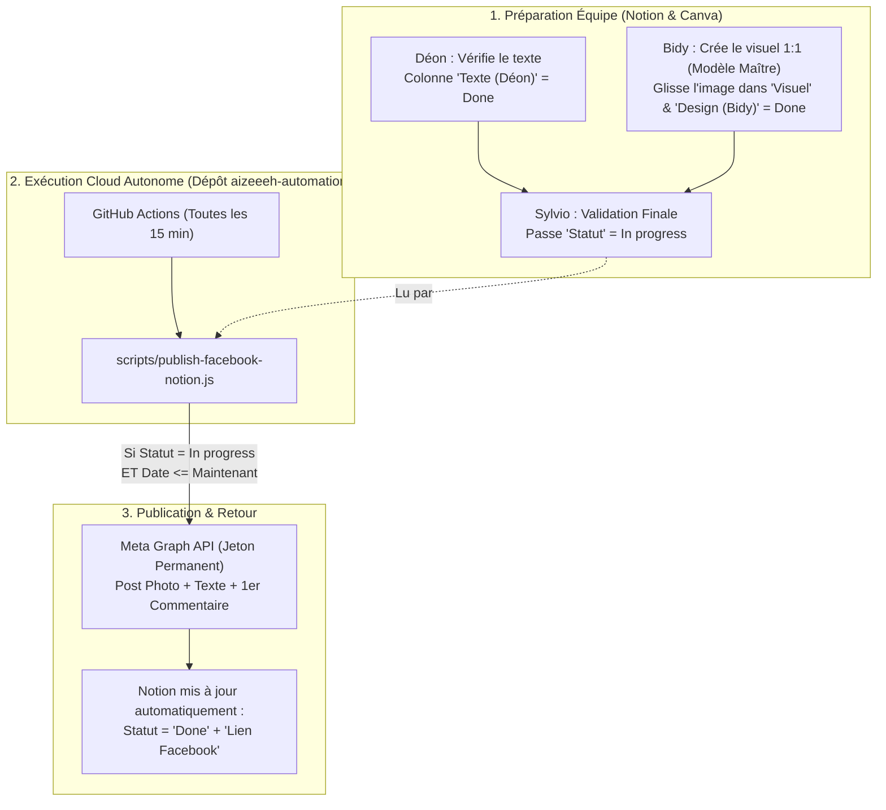

# Conception Technique : Automatisation Cloud GitHub Actions & Modèle Maître Canva — Aizeeeh

> **Date :** 06/10/2026  
> **Projet :** Aizeeeh (`aizeeeh.digital514.mg`) — Propulsé par **DIGITAL 514**  
> **Objectif :** Exécuter l'automatisation des publications Facebook (Notion ➔ Meta Graph API) 100 % dans le Cloud via un dépôt GitHub dédié (`aizeeeh-automation`), sans jamais bloquer l'espace de travail Antigravity ni interférer avec le dépôt Lovable.

---

## 1. Architecture Globale & Séparation des Responsabilités

---

## 2. Pourquoi un Dépôt Dédié `aizeeeh-automation` ?

1. **Zéro risque pour Lovable :** Le dépôt principal de l'application web (`aizeeeh.digital514.mg`) n'est jamais pollué par des commits d'automatisation marketing.
2. **Zéro blocage dans Antigravity :** Aucun minuteur local (`/schedule`) ne tourne dans le chat. Vous pouvez travailler librement ou éteindre votre PC.
3. **Jeton Facebook Permanent (`expires_at: 0`) :** Stocké dans les **GitHub Actions Secrets** chiffrés, il n'expire jamais.

---

## 3. Règles de Gestion et Sécurité des Secrets

| Secret GitHub Actions | Rôle |
| :--- | :--- |
| `NOTION_API_KEY` | Jeton d'accès à l'espace Notion AIZEEEH |
| `NOTION_DATABASE_ID` | ID du calendrier éditorial (`3ea24d1bf2a781f89aa7f1bf219c3363`) |
| `FB_PAGE_ID_D514` | ID de la Page Facebook Digital 514 (`840873129103171`) |
| `FB_PAGE_ACCESS_TOKEN_D514` | Jeton Permanent (Never-Expiring) de la Page Digital 514 |
| `FB_PAGE_ID_AIZEEEH` | ID de la Page Facebook Aizeeeh |
| `FB_PAGE_ACCESS_TOKEN_AIZEEEH` | Jeton Permanent de la Page Aizeeeh |

> **Sécurité :** Le fichier `.env.facebook` et `.agents/mcp_config.json` sont strictement exclus du dépôt Git via `.gitignore`.

---

## 4. Standard du Modèle Maître Canva (`1:1` - `1080x1080px`)

- **Ratio obligatoire :** `1:1` (`1080 x 1080 px`).
- **Palette stricte :** Bleu Nuit (`#0a1931`), Corail (`#ff6b6b`), Blanc (`#ffffff`), Crème (`#ffeac1`), Gris (`#b0b8c4`).
- **Workflow Bidy :** Bidy duplique le Modèle Maître pour chaque jour, insère le visuel dans la colonne `Visuel` de Notion et passe `Design (Bidy)` sur `Done`.
